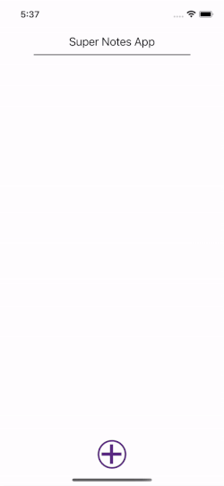

# Notes app

Application was introduced as a workshop example to the Academy students.

### App stack: 
- React-native / JavaScript
- sqlite
- redux toolkit 

Based on Expo managed flow.

Expo link: https://expo.dev/@agileslava/notes-app?serviceType=classic&distribution=expo-go

App demo:

